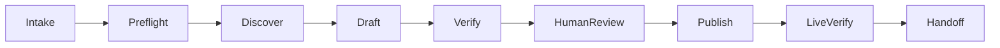

# Xsolla Game Web Portal — Agentic Onboarding Specification

## Requirements

### Input

Collect missing values in one question:

```yaml
merchant_id:
project_id:
domain:
game_name:
store_url:
primary_locale:
existing_portal_policy: update | create-new
```

Optional: approved brand assets, analytics IDs, and locales. Never invent or
reuse partner identifiers, credentials, content, prices, assets, or URLs.

### Acceptance scenarios

1. **Platform:** GIVEN a store URL, WHEN the exact host is
   `store.steampowered.com`, THEN continue as PC; Mobile, unknown, invalid, or
   spoofed hosts return `needs_input`.
2. **Existing portal:** GIVEN the domain exists, WHEN onboarding starts, THEN
   inspect and resume without duplicates; ambiguous matches require selection.
3. **Access:** GIVEN a mutation returns `401/403`, WHEN work is partial, THEN
   preserve the ledger, return `needs_access`, reauthenticate, re-read, resume.
4. **Login:** GIVEN sign-in succeeds, WHEN binding fails, THEN Login and
   onboarding remain incomplete until binding is verified.
5. **Publication:** GIVEN HTTP 200, WHEN an older version is visible, THEN
   publication remains incomplete.
6. **Launcher:** GIVEN a Launcher exists, WHEN build, installer, or download
   evidence is missing, THEN Launcher is incomplete and publish-anyway is
   refused.
7. **Handoff:** GIVEN the run ends, WHEN reporting, THEN repeat merchant ID,
   project ID, domain, Steam URL, and locale with evidence for every Completed
   item.

## Design

### Flow



### Status

- `completed` — effect verified.
- `placeholder` — visible and temporary.
- `needs_input` — value or choice missing.
- `needs_access` — authorization invalid.
- `needs_human` — manual action required.
- `blocked_capability` — CLI cannot perform the action.
- `failed` — action failed or cannot be verified.

### Evidence contract

| State | Required evidence | Stop condition |
|---|---|---|
| Preflight | CLI context, exact Steam host, domain search | Missing/ambiguous input |
| Discover | Existing IDs, supported type and skills | Unsupported structure |
| Draft | Mutation response and read-back | Read-back mismatch |
| Verify | Structure, preview, readiness result | Pending/failed verification |
| HumanReview | Approval and disclosed gaps | Approval missing |
| Publish | Supported command or confirmed human action | Publish unconfirmed |
| LiveVerify | Public URL, expected version/routes, Login/commerce | Stale/incomplete state |
| Handoff | Full context, statuses, evidence, next actions | Completed lacks evidence |

### Existing vs desired

Before mutation:

| Existing state | Desired state | Action |
|---|---|---|
| Verified entity ID and values | Requested change | Create, update, ask, or stop |

Never recreate discovered existing entities.

## Run checklist

### 1. Context

- Confirm merchant/project, domain, locale, and create/update policy.
- Validate exact Steam host.
- Resolve ambiguity and disclose unsupported/human gates.

### 2. Existing state

- List websites and read the target structure.
- Capture landing, page, and block IDs.
- Compare existing and desired state.
- Resume at the first incomplete item.

### 3. One change group

Portal structure — creation and landing type, pages, blocks, theme, assets, copy
and localization, domain, analytics, preview — runs against the Shop Builder API
in [portal-api.md](portal-api.md). Use related skills for everything else,
instead of repeating their command recipes:

- `merchant-setup` — merchant/project/API key.
- `catalog-design` — catalog and pricing.
- `login-setup` — Login.
- `headless-checkout-integration` — checkout.

Sections: Home, News, Rewards, Web Shop, Community, optional Launcher.
Placeholders require approval and visible labels. Launcher requires a real
Launcher, uploaded build, generated installer, and verified download.

### 4. Verify

- Read back changed entities.
- Refresh preview and confirm rendered output.
- Update the ledger.
- Keep unverified items out of **Completed**.

### 5. Draft gate

`draft_ready` requires correct ownership/domain/type/locale, no duplicate
routes, verified content, disclosed placeholders, explicit Login/commerce
status, and no readiness failure.

### 6. Review and publish

- Present Completed, placeholders, blockers, and failures.
- Require publication approval.
- Use a supported command or return `needs_human`.
- Resume after confirmed human publication.

### 7. Live verification

`published_verified` requires the expected public version/routes, working Login
and binding, and verified Web Shop/Launcher outcomes. HTTP 200 with stale
content is incomplete.

### 8. Handoff

```markdown
# Xsolla Game Web Portal onboarding report

Overall status:

## Confirmed context
- Merchant ID:
- Project ID:
- Domain:
- Steam URL:
- Primary locale:

## Sections
| Section | Page ID | Route | Status | Evidence |
|---|---|---|---|---|

## Completed
- Verified action + evidence

## Placeholders
- Temporary content + label

## Needs input / human action
- Action + owner + value + verification

## Blocked capabilities
- Capability + impact + next step

## Failed
- Action + error + recovery

## Publication
- Status:
- Preview/public URL:
- Evidence:
```

Honest partial completion is correct. Simulated completion is failure.
