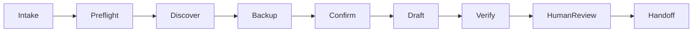

# Xsolla Game Web Portal — Agentic Onboarding Specification

## Requirements

### Input

Collect missing required values in one question; values `shop-plan`'s intake recorded in the
ledger are not asked again:

```yaml
merchant_id:
project_id:
domain:
game_name:
primary_locale:
```

Optional: `store_url` (Steam), approved game description and brand assets,
analytics IDs, and locales. A Steam URL is a reference, not a production
dependency, and may be skipped. Metadata and assets come from the partner either
way, because Steam pages are not imported. Never invent or reuse partner
identifiers, credentials, content, prices, assets, or URLs.

### Acceptance scenarios

1. **Platform:** GIVEN no store URL, WHEN the title is confirmed as PC and
   approved metadata/assets are supplied, THEN continue without Steam parsing.
   GIVEN a store URL, its exact host must be `store.steampowered.com`; Mobile,
   unknown, invalid, or spoofed supplied URLs return `needs_input`.
2. **The partner's site:** GIVEN the partner created the site from the Multi-page web
   portal template, WHEN onboarding starts, THEN inspect it and add only the missing
   sections, without duplicates; ambiguous matches require selection. GIVEN no site at
   the domain, THEN return `needs_human`: the agent never creates a site. GIVEN a site
   without `/news`, `/rewards` or `/store`, THEN return `needs_input`: it wasn't made from
   the template.
3. **Access:** GIVEN a mutation returns `401/403`, WHEN work is partial, THEN
   preserve the ledger, return `needs_access`, reauthenticate, re-read, resume.
4. **Login:** GIVEN sign-in succeeds, WHEN binding fails, THEN Login and
   onboarding remain incomplete until binding is verified.
5. **Publication:** GIVEN the draft is ready, WHEN the run ends, THEN the agent has
   not published, run the readiness check, or generated a preview, and the handoff
   lists those as `needs_human` steps for Publisher Account.
6. **Launcher:** GIVEN a Launcher exists, WHEN build, installer, or download
   evidence is missing, THEN Launcher is incomplete and publish-anyway is
   refused.
7. **Handoff:** GIVEN the run ends, WHEN reporting, THEN repeat merchant ID,
   project ID, domain, locale, and Steam URL only if supplied, with evidence for
   every Completed item.

## Design

### Flow


```mermaid
flowchart LR
  Intake --> Preflight
  Preflight --> Discover
  Discover --> Backup
  Backup --> Confirm
  Confirm --> Draft
  Draft --> Verify
  Verify --> HumanReview
  HumanReview --> Handoff
```

Readiness check, preview, publication, live verification and rollback come after the
handoff and belong to the human, in Publisher Account.

### Status, ledger, resume

Statuses, the ledger, resume, and the handoff report are the
[onboarding contract](../../shop-plan/references/onboarding-contract.md). This file adds
the portal's own states and evidence.

### Evidence contract

| State | Required evidence | Stop condition |
|---|---|---|
| Preflight | CLI context, PC confirmation, Steam host if supplied, domain search | Missing/ambiguous required input |
| Discover | Existing IDs, supported type and skills | Unsupported structure |
| Backup | Export directory of the existing site, before the first write | Export failed |
| Confirm | Explicit approval of the shown plan | Approval missing |
| Draft | Mutation response and read-back | Read-back mismatch |
| Verify | Structure and localization read back, matching the plan | Pending/failed verification |
| HumanReview | Approval and disclosed gaps | Approval missing |
| Handoff | Full context, statuses, evidence, human next steps | Completed lacks evidence |

### Existing vs desired

Before mutation:

| Existing state | Desired state | Action |
|---|---|---|
| Verified entity ID and values | Requested change | Create, update, ask, or stop |

Never recreate discovered existing entities.

## Run checklist

### 1. Context

- Confirm merchant/project, the partner's site domain, and locale.
- Confirm PC scope. Validate the exact Steam host only when `store_url` is supplied.
- If `store_url` is omitted, confirm approved metadata and assets are available.
- Resolve ambiguity and disclose unsupported/human gates.

### 2. Preflight

- Run `scripts/preflight.py` for the merchant, project and approved test-project
  allowlist. If it fails, stop before any write.

### 3. Existing state

- List websites and read the target structure.
- Confirm the site has the template's `/news`, `/rewards` and `/store` pages.
- Capture landing, page, and block IDs.
- Compare existing and desired state.
- Resume at the first incomplete item.

### 4. Back up

- Export the site to a new local directory before the first write. A failed export
  stops the run.

### 5. Plan and confirm

- Show the ordered change groups and the exact removals; wait for an explicit yes.

### 6. One change group

Portal structure — pages, blocks, theme, assets, copy and localization, analytics — runs
through the CLI commands listed in [portal-api.md](portal-api.md). Use related skills for
everything else, instead of repeating their command recipes:

- `merchant-setup` — merchant/project/API key.
- `catalog-design` — the catalog and pricing the Web Shop sells.
- `login-setup` — Login.

Checkout is the Web Shop's hosted Pay Station: nothing to integrate.

Sections: Home, News, Rewards and Web Shop from the template, and Community added by the
agent. Placeholders require approval and visible labels. The Launcher section is the
partner's: it requires a real Launcher, uploaded build, generated installer, and verified
download.

### 7. Verify

- Read back changed entities and compare them with the confirmed plan.
- Update the ledger.
- Keep unverified items out of **Completed**.

### 8. Draft gate, review and hand over

- `draft_ready` requires correct ownership/domain/type/locale, no duplicate routes,
  read-back-verified content, disclosed placeholders, and explicit Login/commerce status.
- Present Completed, placeholders, blockers, and failures.
- Hand the human, as `needs_human`: the readiness check, the preview, publication
  (per page, main page first), live verification, and any rollback.
- Never publish, run the readiness check, or generate a preview key.

### 9. Handoff

The handoff is the onboarding report in the
[onboarding contract](../../shop-plan/references/onboarding-contract.md#handoff-report).
The portal fills its **Storefront** section with:

```markdown
- Domain:
- Steam URL (include only if supplied):

| Section | Page ID | Route | Status | Evidence |
|---|---|---|---|---|

Your next steps in Publisher Account:
- Reload the Editor before checking the portal: it doesn't refresh after CLI writes yet
- Run the readiness check and open the preview
- Publish (main page first), then confirm the public URL
- Not published by the agent
```

### After the human publishes

If the partner comes back after publishing, a resumed run may read the public site
and report what it sees. HTTP 200 with stale content is incomplete; the expected
version and routes, working Login and binding, and verified Web Shop/Launcher
outcomes are what the partner is asked to confirm.

Honest partial completion is correct. Simulated completion is failure.
